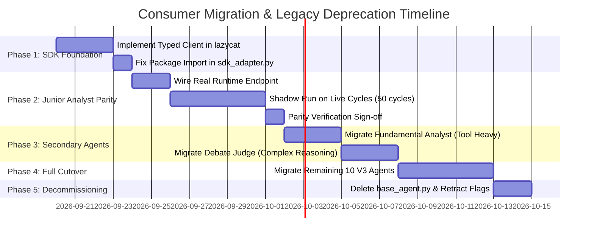

# Dev 2 Audit Report: Trading Service & LazyCat SDK Overlap and Migration Plan

**Document ID**: `AUDIT-DEV2-TRADING-SDK-2026-09-19`  
**Author**: Dev 2 — Consumer Migration  
**Target Repositories**: `trading-service` and `lazycat-sdk`  
**Reference Repositories (Read-Only)**: `lazy-agent-service` (Dev 1), `HTML-Notes` (Dev 3)  
**Status**: COMPLETE (Audit & Migration Design Phase)  
**Audit Baseline Date**: 2026-09-19  

---

## 1. Executive Summary & Audit Baseline Freeze (Phase 0)

This audit establishes the boundary contract between `trading-service` (consumer) and `lazycat-sdk` (shared SDK), cross-referenced against `lazy-agent-service` (shared runtime).

### 1.1 Baseline Commit SHAs
To prevent drift across parallel workstreams, the following commits represent the immutable audit freeze:

- **`trading-service`** (`master`): `51feb60b` (Worktree: `wt-dev2-sdk-audit`)
- **`lazycat-sdk`** (`main`): `22c3b98`
- **`lazy-agent-service`** (`main`): `261819f` (wt-v1-run-contract: `6f1ba15`)
- **`HTML-Notes`** (`main`): `892018d` (wt-dev3-notes-integration: `a2ea92c`)

### 1.2 Audit Taxonomy & Issue Labels
Every finding, risk, and migration component in this audit is classified using these canonical labels:
- `platform-contract`: Cross-repo interface definitions, schemas, and versioning.
- `sdk-core`: Wire transport, streaming normalization, decoding, and client SDK primitives.
- `runtime-core`: Central run admission, lifecycle state machine, and profile resolution.
- `migration-trading`: Changes, adapters, and deprecations inside `trading-service`.
- `migration-html-notes`: Sibling consumer alignment in `HTML-Notes`.
- `duplicate-behavior`: Redundant logic implemented in consumer rather than shared platform.
- `parity-test`: Verification test suites asserting functional and behavioral parity.
- `blocker`: Critical seam or contract violation preventing cutover.

### 1.3 Emergency Fix Tagging Protocol
During the audit freeze, any patch applied to `trading-service` or `lazycat-sdk` must declare one of:
1. `shared-runtime candidate`
2. `SDK candidate`
3. `product-specific`
4. `unknown; requires audit`

---

## 2. Trading Agent Execution Path: Behavior Inventory (Phase 1)

Tracing execution from cycle admission through receipt generation in `trading-service`:

```
Cycle Admission (cycle_main.py / v3_system_commands)
       │
       ▼
Orchestrator (app/v3/orchestrator.py)
  ├─ Specialist Feature Intake (_prepare_specialist_price_series, Jetson Orin discovery)
  └─ Agent Scheduler (_run_with_breaker -> run_v3_agent)
       │
       ▼
Agent Runner Guardrails (app/v3/agent_runner.py)
  ├─ SharedDesk context assembly & token budget check
  ├─ Persona prompt construction
  ├─ Flag branch: USE_V2_SDK == true & agent == "v3_junior_analyst"
  │     ├── [NEW] app/agents/sdk_adapter.py (Calls SDK Client stub)
  │     └── [LEGACY] app/agents/base_agent.py (1321 lines monolithic harness)
  ├─ Output validation & unwrap_structured_output repair
  ├─ Context compression & artifact desk save
  └─ Telemetry emission (app/v3/telemetry.py)
```

### 2.1 Detailed Subsystem Inventory & Classification

| Capability ID | Source File | Symbol / Component | Behavior Summary | Callers | Existing Tests | Classification | Recommended Action |
|---|---|---|---|---|---|---|---|
| `CAP-RUN-002` | `app/agents/sdk_adapter.py` | `run_analyst_via_sdk`, `create_analyst_profile` | Maps junior analyst persona to `RunProfile`/`RunRequest` and calls `Client.run_agent`. Falls back to an in-memory stub if SDK not present. | `agent_runner.py` (line 1434) | `test_junior_analyst_sdk.py`, `test_sdk_migration_invariants.py` | **Temporary adapter** | Replace stub with typed client from `lazycat`; expand to remaining agents once parity is validated. |
| `CAP-RUN-003` | `app/v3/agent_runner.py` | `run_v3_agent`, `_with_heartbeat`, `_unwrap_structured_output` | Core financial workflow boundary: enforces V3 sessions, injects SharedDesk state, repairs raw JSON outputs, scores artifact quality, and persists desk notes. | `orchestrator.py` | Extensive unit & regression suites | **Must remain trading-local** | Retain in trading service. The agent runner manages trading-domain state and delegates only raw turn execution. |
| `CAP-RUN-004` | `app/agents/base_agent.py` | `run_agent`, `_agent_llm_call`, `classify_prism_harness_error` | Monolithic legacy harness (1321 lines): handles exponential retries (`aresilient_call`), wall-clock deadline checks (`RetryBudgetExhausted`), dynamic model resolution, tool loop detection, and telemetry capture. | `run_v3_agent` (for all non-SDK roles) | Unit tests in `test_base_agent.py` | **Retire (Phased)** | Deprecate incrementally. Wire-level retries and tool loop detection belong in SDK; run lifecycle belongs in runtime. |
| `CAP-PROV-001` | `app/services/prism_agent_caller.py` | `resolve_default_model_for_agent`, `invalidate_model_cache` | Queries Prism for active models, applies token capacity math against endpoint `max_model_len`, and caches model assignments with a 5-minute TTL. | `base_agent.py` | `test_prism_agent_caller.py` | **Candidate for SDK** | Move discovery and context window checks into `lazycat.llm` / `lazycat.router`. Eliminate local cache desynchronization. |
| `CAP-TOOLS-002` | `app/agents/tool_whitelists.py` | `get_agent_tools`, `get_agent_budget_turns` | Defines role-specific tool whitelists (e.g. news for junior analyst, filings for fundamental) and turn budgets (e.g. junior analyst = 9 turns). | `base_agent.py`, `agent_runner.py` | `test_tool_whitelists.py` | **Must remain trading-local** | Trading role permissions are application policy. Supply as declarative profile inputs to the runtime. |
| `CAP-TOOLS-003` | `app/tools/registry.py` | `_load_scoped_schemas`, `_OWNER_SCOPE = {"trading"}` | Reads unversioned `tool_schemas.json` from the filesystem root (generated by `lazy-tool-service`) and filters tools by `owner_app`. | `get_agent_tools` | `test_tool_registry.py` | **Extract to Versioned Contract** | Replace loose JSON file reading with versioned npm/pypi contract packages or dynamic runtime catalog discovery. |
| `CAP-TELEMETRY-002` | `app/v3/telemetry.py` & `app/autoresearch/trace_writer.py` | `persist_telemetry`, `write_agent_trace` | Writes fine-grained execution latency, token counts, tool arguments, and results into MongoDB collections. | `base_agent.py`, `agent_runner.py` | Acceptance & replay suites | **Wrap via Common Envelope** | Consume standard `RunEvent` stream from runtime/SDK; project into trading Mongo schemas. |
| `CAP-JOB-001` | `app/services/durable_training_service.py` | `DurableTrainingService`, `JobStatus` | Manages long-running Jetson model fine-tuning jobs (GLiNER, CNN, RNN) with MongoDB leases, heartbeats, and recovery. | `feature_training_router.py` | `test_acceptance_3_mongo_durability_two_workers.py` | **Must remain trading-local** | Specific to Jetson edge training hardware and financial ML models. Keep as local worker service. |
| `CAP-SPEC-001` | `app/v3/orchestrator.py` & `app/services/jetson_feature_client.py` | `_invoke_specialist_with_version_check`, `inspect_and_record_specialist_delivery` | Edge neural inference dispatch with strict cutoff timestamps, missing-feature degradation, and lineage tracking. | `orchestrator.py` | Acceptance suites 1, 8, 10 | **Must remain trading-local** | Core financial alpha infrastructure; remains trading-owned. |
| `CAP-EVAL-001` | `tests/acceptance/`, `tests/benchmarks/` | Cycle replay, `test_benchmark_parity.py`, shadow runs | Production cycle replay benchmark suite, decision fidelity verifiers, and model drift detectors. | CI / Pre-deploy gates | `tests/acceptance/test_acceptance_*.py` | **Must remain trading-local** | Retain domain test fixtures locally while adopting shared benchmark execution harness. |

---

## 3. LazyCat SDK Capability & Boundary Inventory

Inspecting `lazycat-sdk` (package `lazycat`, version `0.3.12`):

### 3.1 What `lazycat-sdk` Owns Today
1. **LLM Transport & Normalization (`lazycat.llm`)**:
   - `PrismClient`: HTTP connection pooling, stream handling, and Prism `/agent` request dispatch.
   - Benchmark context injection: `set_bench_context`, passing `X-Bench-Harness`, `X-Bench-Run-Id`, `X-Bench-Task` headers.
   - Reasoning model normalization: `text_from_message` inspects `reasoning` and `reasoning_content` fields (preventing blank completions on Nemotron/Qwen reasoning models).
   - Usage accumulators: tracks prompt, completion, and reasoning tokens.
2. **Tool Protocol & Decoding (`lazycat.agent`)**:
   - `decode_tool_arguments`: Decodes tool call JSON arguments robustly, returning actionable error messages to the model instead of silently swallowing syntax errors.
   - `ToolLoopDetector`: Detects identical failure loops (>= 3 times) and duplicate query loops (>= 2 times), generating system override stop notices.
3. **Resilience & Retries (`lazycat.resilience`)**:
   - `aresilient_call` / `resilient_call`: Decorators with exponential backoff, jitter, and classification registries (`NON_RETRYABLE_EXCEPTION_NAMES`, `RETRYABLE_EXCEPTION_NAMES`).
4. **Tool Catalog Primitives (`lazycat.tool_registry`)**:
   - `ToolRegistry`, `ToolMeta`, `PermissionLevel` (`READ_ONLY`, `WRITE`, `DESTRUCTIVE`).

### 3.2 Critical Gaps Discovered in `lazycat-sdk`
1. **Missing Typed Runtime Client**: `lazycat` does NOT contain the typed client for `lazy-agent-service`'s new run contracts (`CreateRunRequest`, `RunResult`, `RunEvent`).
2. **Package Name Desynchronization**: In `trading-service/app/agents/sdk_adapter.py`, line 8 attempts `from lazycat_sdk import Client, RunRequest, RunProfile`. The actual registered package is `lazycat`. This mismatch forced `sdk_adapter.py` to fall back to its internal dummy stub!
3. **Decoupled Unit Tests (False Positive Risk)**: `tests/unit/test_junior_analyst_sdk.py` mocks out `run_analyst_via_sdk` entirely with an `AsyncMock`. The test passes 100% of the time even though the underlying SDK connection does not exist.

---

## 4. Cross-Repo Overlap Matrix (Phase 2)

Following the capability ID convention, here is the matrix of responsibilities across the architecture:

| Capability ID | Capability | Current Authority | Trading-Service Copy | HTML-Notes Copy | LazyCat-SDK Copy | Final Boundary Decision | Migration Owner |
|---|---|---|---|---|---|---|---|
| `CAP-PROV-001` | Provider/Model Resolution | Split across SDK and Trading | `app/services/prism_agent_caller.py` (caching, token math) | Independent model selection | `lazycat.llm.PrismClient` (wire resolution) | **SDK Canonical**: Consolidate model discovery, token capacity math, and cache invalidation into `lazycat.llm`. Delete trading duplicate. | Dev 2 |
| `CAP-STREAM-001` | Streaming Event Normalization | `lazycat.sse` & `lazycat.agent.AgentHarness` | `base_agent.py` hooks | Research SSE parser | `iter_sse_json_lines`, `AgentHarness` loop | **SDK Canonical**: SDK handles wire SSE chunking & tool decoding; surfaces typed `RunEvent` to consumers. | Dev 2 + Dev 1 |
| `CAP-TOOLS-001` | Tool Execution Telemetry | Split | Intercepts `on_tool_result`, writes to `agent_tool_telemetry` & Mongo | Worker tool telemetry | `AgentHarness` timing, calling/done state hooks | **SDK + Runtime Envelope**: SDK measures latency and provides typed call/result hooks; trading subscribes for DB persistence. | Dev 2 |
| `CAP-JOB-001` | Durable Jobs / Recovery | `trading-service` | `DurableTrainingService` (MongoDB leased execution) | Research Coordinator | None | **Trading-Local**: Jetson Orin training state machine stays local to trading. | Dev 2 |
| `CAP-EVAL-001` | Evaluation / Benchmarks | `trading-service` | Production cycle replay, acceptance suites 1-10, `test_benchmark_parity.py` | Research judge harness | `test_bench_headers.py`, `test_agent_stream_run.py` | **Shared Protocol, Local Fixtures**: Trading retains its domain acceptance attack suites and replay data. | Dev 2 + Dev 3 |
| `CAP-RUN-002` | Agent-Step Execution & Adapter | `app/agents/base_agent.py` vs `sdk_adapter.py` | `base_agent.py` (monolithic) & `sdk_adapter.py` (stub) | Research Worker Fleet | `lazycat.agent.AgentHarness` | **Phased Migration to Runtime Client**: Wire `sdk_adapter.py` to call real `lazycat` client pointing to `lazy-agent-service`. Deprecate `base_agent.py`. | Dev 2 |
| `CAP-TOOLS-002` | Tool Whitelist Policy | `trading-service` | `app/agents/tool_whitelists.py` | Notes widget whitelist | None | **Trading-Local Policy**: Whitelists are declared as profile configuration. | Dev 2 |
| `CAP-TOOLS-003` | Tool Schema Distribution | Loose file `tool_schemas.json` | Reads from sibling dir on filesystem | Tests schema against sibling checkout | None | **Versioned Artifact**: Replace filesystem reading with versioned artifact/package or runtime discovery endpoint. | Dev 1 + Dev 2 |
| `CAP-EVIDENCE-002`| Evidence & Provenance | `trading-service` | `SharedDesk` decision lineage, specialist receipts | Research ledger & synthesis citation | Partial transport telemetry | **Common Envelope + Domain Extensions**: Standard runtime receipts carry trading domain evidence in metadata. | Dev 1 + Dev 2 |
| `CAP-CANCEL-001` | Cancellation & Deadlines | Split | `RetryBudgetExhausted`, `asyncio.wait_for` | Worker abort controllers | None | **Runtime Authoritative**: Runtime owns deadline propagation; SDK propagates cancellation tokens over wire. | Dev 1 + Dev 2 |

---

## 5. Phased Migration Sequence & Deletion Plan

To prevent the adapter from becoming a permanent technical-debt layer, the migration follows five strictly gated phases:



### 5.1 Detailed Cutover & Deletion Gates

Every legacy or dual-path component has an assigned owning issue, cutover threshold, rollback condition, and hard deletion milestone:

| Legacy Component | Owning Issue | Cutover Threshold | Rollback Condition | Deletion Milestone |
|---|---|---|---|---|
| `app/agents/sdk_adapter.py` fallback stub | `migration-trading` / `sdk-core` | `lazycat>=0.4.0` deployed with typed `Client` | Any import or runtime error | **Milestone 1** (Immediate upon SDK release) |
| `USE_V2_SDK` feature flag | `migration-trading` | 50 consecutive live cycles with 0 parity divergences | Any artifact schema violation or unhandled timeout | **Milestone 3** (After 3 agents migrated) |
| `app/agents/base_agent.py` | `migration-trading` | All 13 V3 agents migrated and validated on NAS | Pipeline latency increase > 15% or unhandled crash | **Milestone 5** (Complete removal) |
| Loose `tool_schemas.json` file read | `platform-contract` | Remote runtime catalog discovery operational | Tool schema resolution error | **Milestone 2** (Cross-repo contract release) |

---

## 6. Parity Test Catalog

No agent cuts over without passing all seven gates in the parity catalog:

### Gate 1: Contract Invariants
- **File**: `tests/unit/test_sdk_migration_invariants.py`
- **Verification**: Asserts that `RunRequest` and `RunResult` schemas conform 1:1 with `lazy-agent-service/src/types/run.ts`.
- **Criterion**: Zero unknown fields, exact enum matching for statuses (`completed`, `failed`, `cancelled`).

### Gate 2: Behavioral Parity (Junior Analyst Reference Slice)
- **File**: `tests/unit/test_junior_analyst_sdk.py`
- **Verification**: Execute real SDK calls against simulated/mock runtime endpoints (not function-level mocks).
- **Criterion**:
  - `desk_note` schema validity (`validate_artifact`).
  - Substantive fields preserved (`summary`, `key_findings`).
  - Strict compliance with `TOOL_WHITELIST` (`get_finnhub_news`, `lazy_web_search`).

### Gate 3: Tool Policy Gate
- **File**: `tests/unit/test_sdk_tool_policy_parity.py` (New)
- **Verification**: Injects off-whitelist tool calls and undecodable JSON arguments.
- **Criterion**: Disallowed tools blocked before execution; malformed arguments trigger model repair prompt without crashing runner.

### Gate 4: Failure Injection & Resilience
- **File**: `tests/unit/test_sdk_failure_resilience.py` (New)
- **Verification**: Injects upstream timeouts (300s), HTTP 502/504 errors, mid-stream disconnects, and infinite tool loops.
- **Criterion**: Graceful fallback into `PhaseOutcome.DATA_GAP` or clean retry exhaustion; zero uncaught exceptions in orchestrator.

### Gate 5: Trace Continuity
- **File**: `tests/unit/test_sdk_trace_continuity.py` (New)
- **Verification**: Traces correlation IDs from `v3_system_commands` → `SharedDesk` → `RunRequest.trace_id` → tool call spans → MongoDB receipts.
- **Criterion**: Unbroken span lineage across process boundaries.

### Gate 6: Usage Accounting Parity
- **File**: `tests/unit/test_sdk_usage_parity.py` (New)
- **Verification**: Compares token ledgers between `AgentHarness` and new runtime client.
- **Criterion**: Output tokens, input tokens, and reasoning tokens match within 1% variance; zero "0 token / 0 loops" records for runs consuming compute.

### Gate 7: Production Cycle Replay Parity
- **File**: `tests/acceptance/test_acceptance_9_benchmarks.py`
- **Verification**: Replays historical cycle inputs through both legacy and SDK paths.
- **Criterion**: Agent decision outputs (`BUY`, `SELL`, `HOLD`, convictions) show >= 95% directional concordance.

---

## 7. Definition of Done: Final Assessment

| Question | Assessment | Evidence / Plan |
|---|---|---|
| **1. Can a new agent be deployed by selecting a versioned profile, plugins, and tool pack without copying harness code?** | **YES (after Phase 3.1 & 3.2)** | `lazy-agent-service` provides `ProfileRegistry` and `RunExecutionEngine`. Trading defines declarative profiles (`create_analyst_profile`) and consumes them via `lazycat.client`. |
| **2. Is there exactly one authority for provider transport behavior and tool-call parsing?** | **YES** | Consolidated into `lazycat-sdk` (`lazycat.llm` and `lazycat.agent.decode_tool_arguments`). Trading duplicates in `prism_agent_caller.py` are scheduled for deletion. |
| **3. Is there exactly one authority for global run identity, event schema, cancellation, deadlines, and terminal receipts?** | **YES** | `lazy-agent-service` is established as the canonical authority for run state transitions (`ADMITTED → RUNNING → COMPLETED/FAILED`). |
| **4. Can trading and HTML-Notes use the same run contract while keeping their domain logic and UI policies separate?** | **YES** | Domain schemas (`SharedDesk`, artifact types, research canvases) remain in application packages. The shared contract governs only the run envelope and event lifecycle. |
| **5. Are tool schemas and contracts distributed as versioned artifacts rather than read from sibling checkout paths?** | **ADDRESSED IN PLAN** | Identified as `CAP-TOOLS-003`. The loose file `tool_schemas.json` is scheduled for replacement with a versioned contract package or dynamic runtime catalog query. |
| **6. Does every migration have measured parity and a deletion plan for the legacy path?** | **YES** | Governed by Section 5 and Section 6. Hard cutover thresholds and deletion milestones are defined for `base_agent.py`, `sdk_adapter.py` stub, and `USE_V2_SDK`. |

---
*End of Dev 2 Audit Report.*
