# Trading cycle scheduling and trace audit — September 10, 2026

The cycle starts are condition-driven, but the system does not consistently establish why another full analysis is valuable now. A separate order-trigger path explains much of the apparent continuous cadence. Replay hides some of the recorded reasons and mislabels that entire path.

This is the requested audit-first milestone. Production behavior has not been changed. The September 8 tool-protocol/arithmetic fixes remain committed locally and undeployed; they are not credited with any result in this report. No learning benchmark or new model run was started during this audit.

## Evidence and scope

Snapshot: 2026-09-10 22:44:44 UTC (15:44:44 PDT), looking back 72 hours. Read 31 cycle summaries and their 31 origin events, 16 watch wakes with 16 fired allocator records, 9 fired order triggers, 34 schedules, 167 active watches, 333 agent-attempt rows and 31 saved ticker desks. Row limits were above the returned cohort sizes. This is a descriptive production sample with repeated tickers and retries, not an independent performance experiment. The final desk reads occurred shortly after the scheduling snapshot and use the same frozen cycle IDs.

Running image labels: trading-service `86ba41d0`; lazy-agent-service `f223a4a`. Both containers were healthy; trading-service HTTP health returned OK. The audited scheduling/allocator/replay files have no diff between that trading image revision and the local checkout. The local pending order-trigger change adds exact fixed-price predicates; the dispatch path audited here is unchanged.

[Frozen evidence](scheduling-evidence-2026-09-10.json) contains cycle IDs, original trigger records, analytical origin corrections, order conditions, allocator evidence and contract errors. Financial statements and earnings dates in those records are treated as input claims, not independently verified facts.

## What starts the work

| Actual origin | Starts | Recorded cycle wall time | Behavior |
|---|---:|---:|---|
| Watch Desk | 16 | 557.3 minutes | 8 news, 7 price-below, 1 staleness |
| Order triggers | 9 | 374.0 minutes | 7 dynamic conditions, 2 stop-loss conditions; all recorded source=manual incorrectly |
| Schedules | 3 | 222.5 minutes | 2 market-open runs, 1 RH earnings follow-up |
| Other/manual-labelled | 3 | 193.9 minutes | Prior observation/manual audit runs; no event reason stored |

These are summed cycle durations, not GPU time or marginal compute cost. Failed/stopped runs are included.

The Watch Desk polls every 15 minutes. Live enforcement is enabled (`WATCH_TRIAGE_MODE=2`), with a 6-wake daily budget, 12-hour per-ticker analysis cadence and 3 analyses per ticker per week. Failed cycles that produced no analysis can be refunded, so 6 is not a hard ceiling on attempted starts. The bounded agent planner is disabled (`WATCH_PLANNER_ENABLED=0`); the dispatch code does not currently call its recommendation function. Comments saying shadow is the default are stale relative to the registry and live records.

The background risk/order monitor runs every minute. Its custom triggers call `PipelineService.start_cycle` directly, outside the Watch Desk's research budget/ranking/cadence. Pipeline-created triggers have a 30-minute creation cooldown. If the worker is busy, the condition stays active and is tried again on later sweeps. Six of nine starts occurred within 70 seconds after the preceding cycle finished. September 10 examples: ADBE 13:17 PDT → CSCO 13:42 → CRDO 14:17 → CRWV 14:44. Their completed cycle durations were 23.6, 34.1, 26.0 and 18.8 minutes. Worker availability plus a backlog of met conditions explains this sequence.

All nine fired order-trigger rows belonged to the `test_bot` paper profile. That name is a stored profile identifier, not proof that an external test launched the runs. The scheduled monitor explicitly includes the active bot and every bot with a held position. Preserve protective paper position handling when changing research allocation.

Sources: `app/services/watch_desk.py` (`evaluate_watches`, `_spend_wake_budget`, `_enqueue_wake`, `_wakes_today`), `watch_policy.py`, `parameter_store.py`, `cycle_scheduler.py` (`_run_background_stop_loss`), `app/trading/order_triggers.py` (`check_triggers`).

## Does the timing make sense?

**Price conditions provide a concrete reason, but not always a new event.** A stored price threshold or moving-average predicate can be true for many consecutive sweeps. The order checker discards the price-age value returned by `_get_current_price`, does not apply the Watch Desk regular-session check, and does not persist the actual quote/metric snapshot in the cycle origin. Five of the nine order-triggered starts occurred after 16:00 ET. This establishes a freshness/lineage gap, not that each quote was stale. SMA triggers compare against the currently stored average; the numeric value recorded when armed is not a fixed-price threshold. The pending September 8 exact-price fix is relevant here.

**News selection is only a rough relevance test.** The Watch Desk requires a company-naming headline and a category keyword, then scores urgency, position risk, uncertainty and recency. Some fired headlines were earnings transcripts or revisions. Others were an Amazon ownership feature or commentary on Intel's earnings and government stake. Those latter records do not establish a new thesis-changing fact. The code treats collection time as freshness; that does not establish publication/event time. Every one of the 16 fired watch records had no stored resolution question. Of 167 currently active watches, only 9 have a structured resolution condition; 158 (94.6%) cannot be screened against such a question. A missing condition incurs a small score penalty, but does not prevent a wake.

**Expected information gain is partly elapsed time.** `watch_triage._expected_information_gain` grows a score with hours since analysis and adds credit for keyword overlap when a resolution question exists. Time passing does not prove fundamentals changed. 11 of the 16 fired watch records reported a stale earnings date; 3 used assumed-hour earnings proximity and 2 used macro proximity. Calendar enrichment affects scores; it does not prove a resolving fact arrived.

**Some scheduled work is genuinely event-linked.** The RH one-shot ran September 9 at 21:30 UTC with an earnings reason and reason codes. One active bot schedule remained: MU at September 21 21:30 UTC, also labelled earnings follow-up. These are stored claims. The governor supports a provider-derived earnings date or an explicit ISO timestamp, rejects retired broad monitoring windows, and requires a reason of at least 10 characters. Explicit timestamps are not independently validated against a real event. Provider day-part mapping is a heuristic: before-open → 09:45 ET, after-close → 17:30 ET, unknown → 16:15 ET. Unknown timing therefore cannot guarantee the report has arrived. A pre-event positioning review and a post-release results review should have distinct purposes and readiness checks.

**Market-open discovery is intentionally clock-driven.** The two market-open starts went through candidate scoring, sector limits, a freshness gate and a gatekeeper. That is a search for opportunities at a trading-session boundary. It should be labelled as such, separately from an earnings or news event. There is no evidence in this cohort of random ticker selection driving the observed single-stock sequence.

## Why replay cannot currently explain it cleanly

1. `_trigger_source` falls through to `manual` for every `edge_case_*` order wake. The order dispatch forwards a broad trigger type but drops trigger ID, original reason, evaluated threshold/metric, quote timestamp and prior cycle linkage. The 9 matched price-trigger records recover some of that context, but the original observation cannot be recreated reliably afterward.
2. Market-open dispatch forwards dynamic-selection mode with an empty ticker list and no explicit origin reason. The cycle gets source=schedule but no schedule ID/reason.
3. Watch origin records carry a headline or price detail, but omit the allocator record ID, open question, score components, competing candidates and waiting time. `watch_events.cycle_id` and fired triage `cycle_id` hold a queue command ID, while replay uses the eventual pipeline cycle ID. The command result can bridge them; the name alone is misleading.
4. `PipelineReplaysPanel` does not render the existing trigger reason in its cycle selector. A shared `triggerLabel` helper exists, but this panel does not use it. Allocator explanations are available through `/api/watch-desk/allocations`, separately from per-cycle replay.
5. Agent traces already exist. They use `run_id` for cycle ID, truncate tool arguments to 2,000 characters and tool results to 500, and record a generic tool-call rationale. The latest audited CRWV cycle had 33 tool trace rows; an empty query using `cycle_id` would wrongly imply no traces.
6. Prompt delivery and gateway receipts primarily store hashes and lengths. Gateway receipts use conversation IDs without a direct cycle/ticker key. They can establish identity when joins exist, but cannot display missing source bytes or explain every transformation. Replay serves final artifacts, telemetry, whiteboard entries and iteration logs; it does not expose a complete transformation history. Its artifact key list also omits valuation and delta reports.

## Artifact finding to address before the learning comparison

Among 333 recorded agent attempts, 43 failed schema validation. Forty-two were Board contract failures across 21 distinct cycle/ticker pairs, each with two failed attempts. One was a collapsed fundamental report. Board failures named missing/invalid `entry_mode`, `trigger_purpose`, and incompatible HOLD/SELL entry modes. The same 21 saved desks retain contract errors. There were 8 successful Board attempt rows elsewhere in the cohort.

This is not evidence that 43 independent decisions failed because of tool repetition. The immediate observed failure is the decision contract. The runner's contract-rejection path returns AGENT_ERROR; its general artifact-repair path is earlier and does not automatically repair these parseable contract failures. The existing receipts do not preserve every rejected original output alongside every normalization step, so this audit does not yet establish whether all 42 violations originated in model output or any upstream transformation. A successful transport, parse, or completed cycle must remain distinguishable from a valid Board decision. These runs should not be treated as a clean learning-effectiveness baseline.

## Tracing tools and recommended architecture

Use **OpenTelemetry for correlation and spans**, with **self-hosted Phoenix as the first trace/evaluation backend to trial**. Keep a domain-specific evidence view in Pipeline Replays. This is an engineering recommendation based on the integration/storage requirements, not a measured tool benchmark.

| Tool | Useful capability | Fit and tradeoff |
|---|---|---|
| OpenTelemetry | Trace/span context across Python and TypeScript; parent/child operations and links | Common instrumentation foundation. It does not infer why data changed or supply an evaluation UI by itself. [Context propagation](https://opentelemetry.io/docs/concepts/context-propagation/), [traces](https://opentelemetry.io/docs/concepts/signals/traces/) |
| Phoenix | Self-hosted trace inspection, evaluations and experiment workflows; OTEL integration | Docker supports SQLite persistence or PostgreSQL. This is the smaller initial deployment to trial on this NAS. Pin a tested version. [Docker storage/deployment](https://arize.com/docs/phoenix/self-hosting/deployment-options/docker), [OTEL setup](https://arize.com/docs/phoenix/tracing/how-to-tracing/setup-tracing/setup-using-phoenix-otel) |
| Langfuse | LLM observability, trace correlation, evaluation and prompt-management workflows | Good alternative if its broader product workflow is preferred. Self-hosting adds web/worker, PostgreSQL, ClickHouse, Redis/Valkey and object storage. [Architecture](https://langfuse.com/self-hosting), [trace IDs](https://langfuse.com/docs/observability/features/trace-ids-and-distributed-tracing) |

Use our own stable versioned event contract and map it to a pinned OpenTelemetry convention version. The GenAI conventions have moved to a separate [official repository](https://github.com/open-telemetry/semantic-conventions-genai); do not couple application behavior to changing attribute names. These tools record instrumented operations and visible outputs; none can recover unrecorded data or establish the truth of a financial claim automatically.

```mermaid
flowchart LR
  A[Event or scheduled purpose] --> B[Candidate assessment]
  B --> C[Deferred / rejected / selected]
  C --> D[Queue wait and dispatch]
  D --> E[Source snapshots]
  E --> F[Memory retrieval and prompt assembly]
  F --> G[Model turns and tool results]
  G --> H[Parse / validate / repair]
  H --> I[SharedDesk append and compression]
  I --> J[Board / synthesis / policy]
  J --> K[Paper execution or no order]
  K --> L[Learning eligibility and outcome]
```

Record one trace per cycle, with linked candidate/queue traces before dispatch and linked learning/outcome traces afterward. Every event needs cycle, ticker, bot/profile, role, attempt, conversation, provider request, parent span and source-event identifiers where available. Unknown identifiers stay explicitly unknown. Instrument `trading-service` and our `lazy-agent-service` adapter; Prism remains an external boundary. Do not assume it propagates `traceparent`; correlate its supported conversation/request identifiers and disclose the visibility gap.

For data lineage, each transformation should record input/output content hashes and retained blob references, operation/version, source publication/observation/collection times, original and retained sizes, omitted/truncated fields, validation errors and whether a repair changed content. Preserve original visible output separately from parsed, normalized, repaired and accepted artifacts. A claimed tool call must have an execution receipt before it is treated as performed research. Large bodies belong in bounded local object storage with retention/redaction, while Mongo or the trace backend indexes IDs and summaries. Log export must not become a dependency that stops risk handling; missing export/coverage must still be visible.

The replay interface should show: **Why this stock? Why now? What changed? What question can this answer? Why this priority? Why did it wait?** Then provide a source-to-decision timeline with clickable evidence and transformation comparisons. A trace that ends in fallback/HOLD must name that disposition, not imply the Board reached a validated conclusion.

## Implementation and benchmark sequence

1. Add an explicit origin envelope to every entry path and show the recorded reason in replay. Include order-trigger evidence and queue/allocator links. Preserve scheduler behavior while validating those traces.
2. Add immutable original-output and transformation records around prompt assembly, tool dispatch/results, parse/validation/repair and SharedDesk compression. Reproduce the Board contract failures from retained evidence before changing model prompts or budgets.
3. Route discretionary reanalysis requests through a common admission policy. Keep protective position checks separate. Prefer verified new facts or a stated unanswered question; distinguish before-event positioning from after-event fact review. Re-evaluate armed conditions with fresh data when the worker becomes available.
4. Replay frozen candidate sets including selected and rejected candidates. Measure relevant-wake precision, missed material catalysts, duplicate/redundant runs, event-to-analysis delay, unavailable evidence and compute cost. Do not optimize only for fewer wakes, stronger BUY counts or higher structural grades.
5. Resume the learning comparison on valid, complete artifacts using the same evidence/model/tool availability in both arms, isolated memory namespaces, preregistered scoring, and all failures/retries charged. The interrupted September 8 probe remains incomplete and cannot support a claimed improvement. Trace IDs should link each benchmark verdict to exact inputs and outputs.

## Audited cycle chronology

All times below are PDT. Source corrections are audit annotations; historical records were not rewritten. `done` is the stored worker status and does not certify complete/valid decision artifacts.

| Start PDT | Tickers | Audited origin | Minutes | Worker status | Recorded reason/type | Cycle ID |
|---|---|---|---:|---|---|---|
| 09-07 21:56 | LULU, MSFT | manual | 21.6 | stopped | no reason stored | `cycle-observe-1788843390` |
| 09-07 22:22 | LULU, MSFT | manual | 99.8 | done | no reason stored | `cycle-observe-1788844926` |
| 09-08 01:03 | ORCL | watch_desk | 32.4 | stopped | ORCL material news: “Oracle Can ‘Sell Any Compute’ It Has, But AI Growth Faces Two Big Constraints, Warns Analyst Gil Luria Ahead Of ORCL's Q” | `cycle-v3-1788854618` |
| 09-08 01:36 | RH | watch_desk | 55.2 | done | RH thesis stale — 14d since last review | `cycle-v3-1788856615` |
| 09-08 03:27 | MSFT | manual | 72.5 | done | no reason stored | `cycle-v3-1788863242` |
| 09-08 04:53 | AMZN | watch_desk | 1.0 | error | AMZN material news: “Amazon's 39% AWS Operating Margin the Single Best Reason to Buy the Stock in September” | `cycle-v3-1788868423` |
| 09-08 05:44 | ORCL | watch_desk | 100.6 | done | ORCL material news: “Oracle Stock Showing Bottoming Signs as Earnings Loom” | `cycle-v3-1788871479` |
| 09-08 07:36 | BKE | watch_desk | 1.0 | error | BKE price $42.70 ≤ $43.44 | `cycle-v3-1788878189` |
| 09-08 07:50 | RKLB | watch_desk | 1.0 | error | RKLB price $65.70 ≤ $66.71 | `cycle-v3-1788879057` |
| 09-08 08:17 | RBC | watch_desk | 9.9 | stopped | RBC price $490.95 ≤ $510.00 | `cycle-v3-1788880665` |
| 09-08 08:35 | CRDO | order_trigger | 56.1 | done | edge_case_dynamic | `cycle-v3-1788881713` |
| 09-08 09:32 | AVGO | order_trigger | 51.9 | done | edge_case_dynamic | `cycle-v3-1788885133` |
| 09-08 10:24 | ZS | order_trigger | 68.2 | done | edge_case_dynamic | `cycle-v3-1788888253` |
| 09-08 11:33 | CRWV | order_trigger | 61.7 | done | edge_case_dynamic | `cycle-v3-1788892393` |
| 09-08 12:42 | BKE | watch_desk | 87.6 | done | BKE price $42.10 ≤ $43.44 | `cycle-v3-1788896524` |
| 09-08 22:10 | ZTS | watch_desk | 37.3 | done | ZTS material news: “Zoetis (ZTS) Shares Drop After Earnings Revision” | `cycle-v3-1788930641` |
| 09-08 23:39 | WBD | watch_desk | 39.2 | done | WBD material news: “Paramount Skydance Moves to Protect Against Costs of Delay as WBD Merger Is Ready to Close” | `cycle-v3-1788935978` |
| 09-09 01:06 | AMZN | watch_desk | 35.4 | done | AMZN material news: “Jeff Bezos Remains Amazon's Largest Individual Shareholder With Roughly 900 Million Shares. Here's Why That Stake Still ” | `cycle-v3-1788941203` |
| 09-09 06:30 | EP, GOOGL, RKLB, STX | schedule | 121.3 | done | market-open candidate selection; no reason stored | `cycle-v3-1788960603` |
| 09-09 09:10 | USA | watch_desk | 34.2 | done | USA price $5.90 ≤ $5.92 | `cycle-v3-1788970203` |
| 09-09 13:16 | ALLY | order_trigger | 33.5 | done | edge_case_stop_loss | `cycle-v3-1788985001` |
| 09-09 14:30 | RH | schedule | 25.6 | done | Research: RH (RH Q2 FY27 earnings (2026-09-09) EPS est $0.41, rev est $942) | `cycle-v3-1788989400` |
| 09-09 22:35 | LE | watch_desk | 38.9 | done | LE material news: “Lands' End (LE) Q2 2026 Earnings Call Transcript” | `cycle-v3-1789018505` |
| 09-09 23:35 | INTC | watch_desk | 26.3 | done | INTC material news: “Jim Cramer on Intel (INTC) Corporation, Earnings Performance, and Government Stake” | `cycle-v3-1789022158` |
| 09-10 06:30 | META, COIN, STX | schedule | 75.6 | done | market-open candidate selection; no reason stored | `cycle-v3-1789047002` |
| 09-10 07:48 | SCHD | watch_desk | 36.2 | done | SCHD price $34.01 ≤ $34.10 | `cycle-v3-1789051709` |
| 09-10 08:36 | MTD | watch_desk | 21.1 | done | MTD price $1288.24 ≤ $1349.36 | `cycle-v3-1789054609` |
| 09-10 13:17 | ADBE | order_trigger | 23.6 | done | edge_case_dynamic | `cycle-v3-1789071450` |
| 09-10 13:42 | CSCO | order_trigger | 34.1 | done | edge_case_stop_loss | `cycle-v3-1789072933` |
| 09-10 14:17 | CRDO | order_trigger | 26.0 | done | edge_case_dynamic | `cycle-v3-1789075033` |
| 09-10 14:44 | CRWV | order_trigger | 18.8 | done | edge_case_dynamic | `cycle-v3-1789076658` |

Evidence SHA-256: `55ae155363108e0904e117986e55ddc688edc487b634ea2efba5bc208d8cb88a`.

## Implemented corrections (September 10)

The frozen audit above describes the pre-change deployment. The following changes address its findings:

- **Task delivery:** the adapter retains the original full user brief as the final user message, instead of replacing it with a compact retrieval query. Signed provider requests verify the exact original brief hash. A NAS canary confirmed all 8,163 user characters and the current Board system persona reached the provider payload. That canary failed at generation because an empty filtered tools array was rejected; the adapter now omits empty tools/tool_choice. A successful live generation and full paper cycle remain pending explicit proxy-validation approval.
- **Role tools:** the adapter restricts both the advertised catalog and returned JSON/SSE calls to the signed role whitelist. Built-in search/code tools cannot silently bypass it. All changes are in lazy-agent-service; Prism was not edited.
- **Board artifacts:** all three persona examples now satisfy the timing contract. Invalid final decisions receive at most one correction, without tools, within the original deadline. The correction must preserve action, confidence, public rationale, sizing, protective levels and evidence. Unresolved or altered decisions fail validation instead of gaining fabricated defaults.
- **Research admission:** watch, scheduled, governor and discretionary order research share the daily budget and ticker cadence. Protective risk reviews retain their exemption. Direct order triggers retain the condition, observation age, evaluation time and admission reason. Deferred one-shot schedules persist their retry time, remain bounded by expiry, and rearm if the queue's second admission check defers them.
- **Observation quality:** discretionary price wakes require an open market and a known quote age of at most 15 minutes. News uses publication time and preserved attribution/source references. Unknown/estimated timestamps and headlines with no recorded resolution condition cannot justify a news research wake. Elapsed time is no longer treated as information gain; maintenance coverage is recorded separately. Allocator failure defers the watch.
- **Earnings follow-up:** an earnings timer is only a check time. Full follow-up research requires the provider to return reported actual EPS or revenue for the exact ticker and event date. Missing data defers the review and records why.
- **Replay:** a new Data Trace tab shows cycle origin, selection records, competing watch allocations and snapshots at source-read, assembled prompt, actual provider payload, tool result, model output, parsing, normalization, correction, accepted artifact, policy, execution and learning boundaries. Snapshots are immutable and content-addressed, bounded to 256 KiB with explicit truncation. Private reasoning and keyed secrets are omitted. Events expire after 30 days; shared snapshot retention follows the most recent reference for 31 days. Old cycles honestly show missing coverage.
- **Interoperability:** the replay exports OTLP/HTTP JSON with W3C-sized IDs, parent links and measured start/end duration for paired spans. Point observations have zero duration. Snapshot bodies stay in Trading. No separate OpenTelemetry collector, Phoenix or Langfuse server is installed by this change.

Validation: adapter 681 tests plus TypeScript typecheck; trading full unit run 7,075 passed with one outdated clock-test fixture, subsequently corrected and rerun with admission/scheduling regressions; 23 real Mongo learning/trace integration checks passed. Frontend production build passed. A muted Chromium check verified the Data Trace screen, pagination and two snapshot selections without page errors, using mocked API responses. The browser and its local server were closed afterward. Deployment verification and the pending live generation/cycle results must be recorded separately; these offline checks do not prove live model decision quality.
